<!-- markdownlint-disable MD033 -->
# Liste des projets open-hardware COVID-FR

Liste des projets open-source pour pallier rapidement à la crise sanitaire du COVID-19. ([Matériel libre](https://fr.wikipedia.org/wiki/Mat%C3%A9riel_libre))

IMPORTANT: Ces différents projets de matériel médical d'urgence open-source ne sont pas homologués. Il proviennent d'un effort collectif international pour trouver des solutions très rapides aux pénuries liées au COVID-19.
Le seul projet vérifié est la [visière de protection PRUSA RC2](https://www.prusaprinters.org/prints/25857-protective-face-shield-rc1) que vous pouvez déjà imprimer et assembler.

Avec le soutien des associations:

  
    
  
  
    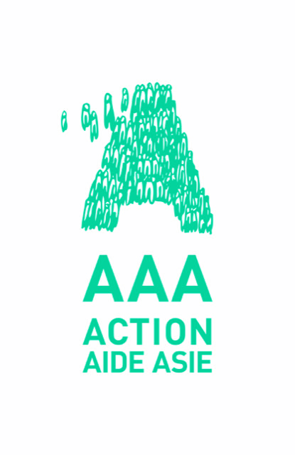
  

## Table des matières

1. [Présentation](#presentation)
   1. [Situation](#situation)
   2. [Collaboration](#collaboration)
   3. [Concours et appels à projet](#concours)
   4. [Cours en ligne gratuits COVID-19](#cours)
   5. [Logistique](#logistique)
   6. [Précautions](#precautions)
   7. [Contribuer](#contribuer)
2. [Liste des projets](#liste)
   1. [Protections](#liste-protections)
      1. [Visière PRUSA](#visiere-prusa)
      2. [Visière laser](#visière-laser)
      3. [Masque OpenMask](#masque-opensourcemask)
      4. [Masque Copper](#masque-copper)
      5. [PAPR](#papr)
   2. [Respirateurs](#liste-respirateurs)
      1. [Respirateur Ambubag](#respirateur-ambubag)
      2. [Respirateur OpenLung](#respirateur-openlung)
      3. [Respirateur CPAP](#respirateur-cpap)
      4. [Valve de dédoublement](#valve-dedoublement)
   3. [Autres](#autres)
      1. [Respirateur vétérinaire](#respirateur-veterinaire)
3. [FAQ](#faq)

## Présentation 

- Plusieurs efforts open-source collaboratifs sont en cours et la communauté makers / hackers se mobilise pour tenter de pallier très rapidement au manque critique de matériel.
- Ce projet vise à lister les projets internationaux et leurs états d'avancement, les traduire en français et mobiliser les personnes ayant du matériel de production accessible. (voir [FAQ](#faq))

## Situation 

- Une pénurie de matériel médical de protection et de ventilateurs de réanimation est en cours et devrait conduire à de très nombreux décès évitables.
- Des capacités de production rapide, grâce aux techniques d'impression 3D et de prototypage rapide, existent en France et pourraient être mobilisées en quelques jours.
- Les autres pays industriels sont dans la même situation que nous et il ne faut pas hélas espérer d'aide internationale rapide.
- Le fort ralentissement de l'industrie chinoise pourrait également entrainer des pénuries d'approvisionnement de pièces nécessaires au fonctionnement du matériel de notre système de santé.

## Collaboration 

- De nombreux ingénieurs, spécialistes et codeurs sont actuellement confinés chez eux et pourraient apporter une aide précieuse pour pallier à la situation de crise que nous affrontons.
- Plusieurs gouvernements, entreprises et particuliers dans le monde travaillent au prototypage et à la fabrication rapide de ces équipements.
- La France dispose d'un large parc d'imprimantes 3D, de fraiseuses numériques et de capacité de production à la demande qui pourraient être mobilisés en quelques heures / jours.
- La mobilisation de ces capacités de production pourrait permettre la réalisation très rapide de matériel pour protéger nos soignants et éviter de nombreuses pertes humaines.

## Liste des appels à projet et concours internationaux COVID 

- [Ministère de la Défense France - Appel à projets 10M€](https://www.defense.gouv.fr/aid/appels-a-projets/appel-a-projets-lutte-covid-19)
- [Université Mc Gill Canada - Concours de design industriel](https://www.agorize.com/fr/challenges/code-life-challenge)
- [Irlande - Ventilateur opensource](https://opensourceventilator.ie/)
- [Appel à projets UE 164M€](https://ec.europa.eu/info/news/startups-and-smes-innovative-solutions-welcome-2020-mar-13_en)

## Cours en ligne gratuits COVID-19 

- En français: [MOOC: Ventilation COVID-19](https://www.fun-mooc.fr/courses/course-v1:UPEC+169003+cv_01/about)
- En anglais: [Coursera: COVID-19](https://www.coursera.org/learn/covid-19)

## Production & Logistique 

### Locale

- Installation de petites unités de production de quelques imprimantes situées dans/à coté des hôpitaux produisant en flux tendu les éléments nécessaires pour le personnel soignant.
- Une equipe de bénévoles se relayant pour assurer le bon fonctionnement de la production.

### Régionale & nationale

- Production des équipements par les particuliers chez eux.
- Un particulier bénévole et/ou un professionel bénévole (type pharmacie, supermarché par dépot, etc.) par zone, centralise la production avant de l'envoyer par transporteurs classiques type chronopost vers les hôpitaux et les structures en demande, en privilégiant les circuits courts.

## Précautions de fabrication 

- Le plastique étant chauffé lors de l'impression à plus de 200 degres, il n'est pas nécessaire de stériliser les bobines de filaments.
- Les éléments produits seront fabriqués avec le maximum de précautions suivant les possibilités sur place: gants, masque, etc.
- Les pièces finies seront emballées dès la fin de l'impression dans des sacs zip hermétiques classiques avec la date et l'heure exacte de fabrication pour éviter l'envoi de tout matériel potentiellement contaminé.
- La durée de vie du virus sur le plastique PLA est supposée être comprise entre de 2 et 5 jours (non-confirmée), le matériel devra donc être porté après ce delais pour garantir leur non-contamination au COVID-19.

## Contribuer maintenant 

### Vous avez une / des imprimantes

- Afin de minimiser la contamination des pièces produites, procédez comme si vous étiez contaminés: gants, masques, etc.
- Acheter des stocks de filament PLA et PET (sans vider les stocks) afin de pouvoir imprimer en continu 24/24 pendant plusieurs jours/semaines.
- Acheter les autres stocks nécessaires (sans vider les stocks): Feuilles plastiques transparentes, bandes élastiques, pochettes zip hermétiques pour l'envoi avec date de production marquée, etc.
- Mobiliser vos amis ayant des capacités de production rapide.

### Vous avez une expertise utile ou souhaitez être bénévole

- Rejoindre un des projets de la liste ou participer à l'appel à projet du ministère de la défense. [Appel à projet FR](https://www.defense.gouv.fr/aid/appels-a-projets/appel-a-projets-lutte-covid-19)
- Si vous êtes un expert qui peut suivre des conversations techniques en anglais, rejoindre [Helpful Engineer](https://github.com/Helpful-Engineers/resources). Une partie des projets de cette page est une traduction française de ces projets.
- Rajouter des projets, corriger des fautes en faisant une Pull Request sur ce repository.

---

## Liste des projets prometteurs 

Veuillez me contacter à cette adresse <philippe@cochin.fr> si vous souhaitez ajouter des projets à cette liste. Une partie de ces projets est accessible en anglais depuis cette page: <https://docs.google.com/spreadsheets/d/19BU6PRRLOAudCeL-yfuzkKgpkxPu5_wGnnUQsEWHfA4/edit#gid=1357829364>

### Protection des soignants 

La protection des soignants est cruciale, la pénurie de moyens de protection est forte et l'utilisation de masques jetables n'est pas forcément optimale si la crise persiste (changement de masque plusieurs fois par jour).

---

#### Visière de protection imprimée Prusa (Statut: validé) 

- **PRESENTATION** Le retour des médecins urgentistes "au front" montre qu'il y a de nombreuses projections contaminantes par les patients. Les autres personnes exposées comme les médecins de ville, caissiers, etc. pourraient également bénéficier de ces visières. La production par les particuliers a déjà commencé.
- **SITE** <https://www.prusaprinters.org/prints/25857-protective-face-shield-rc1>
- **VALIDATION** Ce projet a été validé par le ministère de la Santé Tchèque.
- **TEMPS PAR UNITE** 2h / imprimante
- **CAHIER DES CHARGES**
  - 32g de filament PLA ou PET
  - Feuille de plastique transparent d'environ 0.5mm au format A4
  - Rouleau de bande élastique
- **MATERIEL**
  - Imprimantes 3D
  - Perforeuse de bureau
- **PRIX PAR UNITE** 1-2€
  
<!--  -->
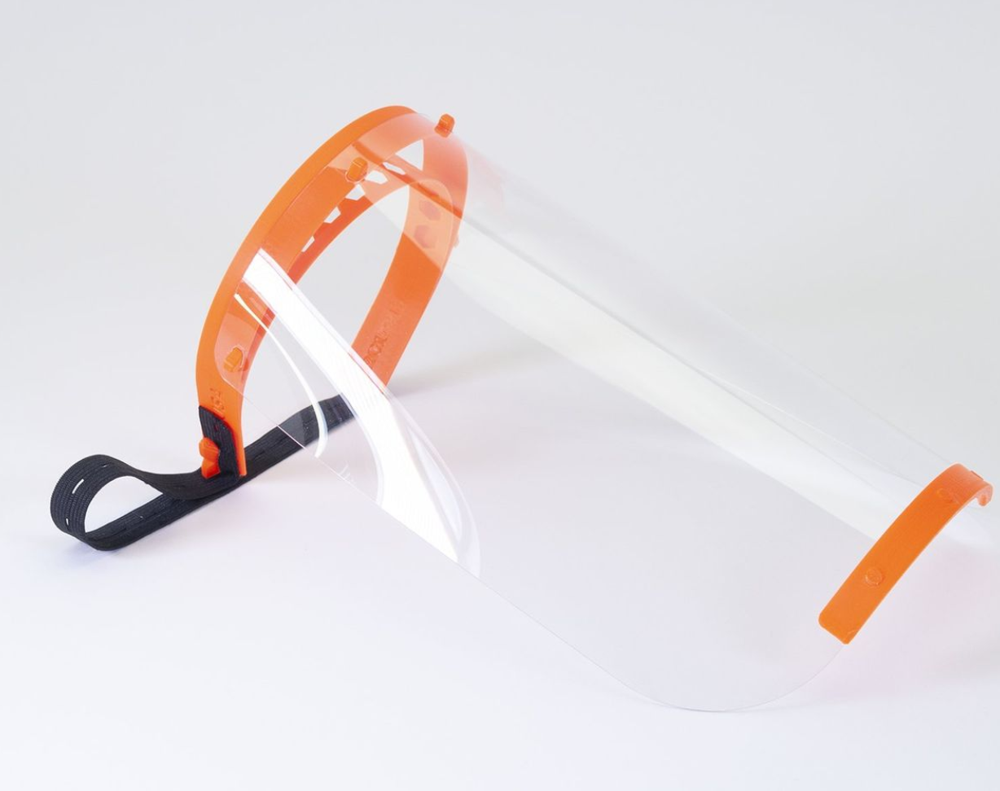

---

#### Visière de protection minimale par découpe laser (Statut: OK) 

- **PRESENTATION** Une visière de protection simple créée par des ingénieurs polonais avec seulement une découpeuse laser.
- **SITE** <https://hackaday.io/project/170481-laser-cut-medical-shield>
- **VALIDATION** Projet non validé mais proche de la visière PRUSA.
- **TEMPS PAR UNITE** 1h30 de découpe sur machine de faible puissance
- **CAHIER DES CHARGES**
  - Feuille de PETG 0.5mm (ou autre similaire)
  - Deux élastiques de 9cm de diamètre.
- **MATERIEL**
  - Découpeuse laser
- **PRIX PAR UNITE** 1-2€
  
<!--  -->
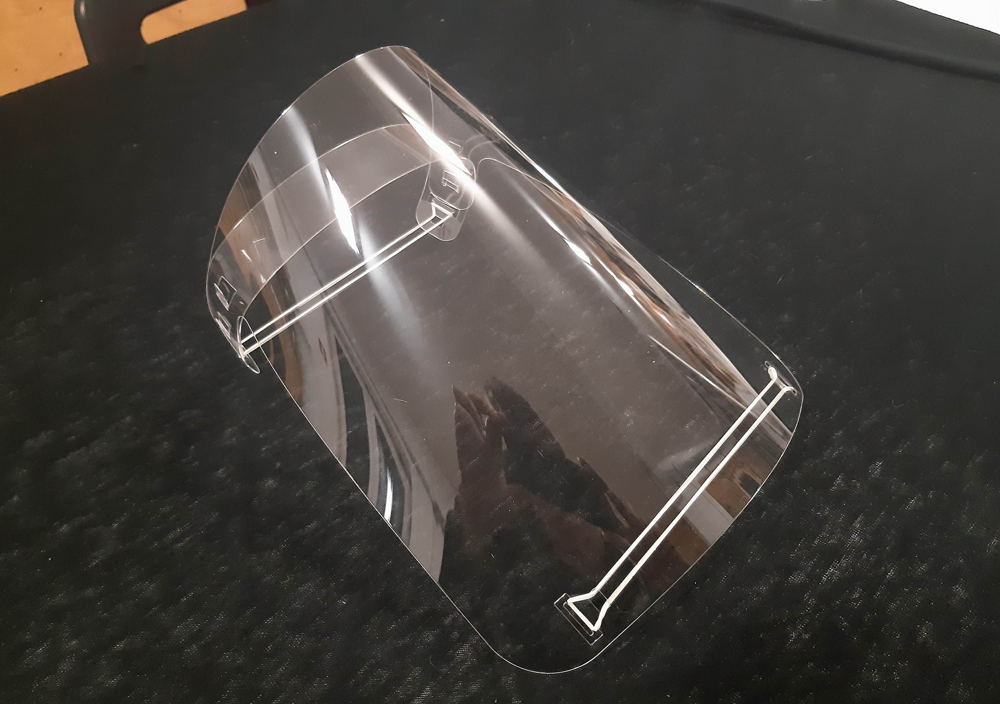

---

#### Masque de protection OpenSourceMask 

- **PRESENTATION** Masque de protection open-source venant d'Italie. Il semble recommandé par cet [article allemand](https://mobilitygoesadditive.org/market-de/coronavirus-your-3d-printing-expertise-is-needed-urgent-request-from-the-european-commission/?lang=de) et ce [groupe italien](http://www.aitasit.org/wp49/)
- **SITE** <https://www.opensourcemask.com/en/>
- **VALIDATION** Non validé
- **TEMPS PAR UNITE** 2h
- **CAHIER DES CHARGES**
  - Filament PLA ou PET
  - Filtre HEPA
- **MATERIEL**
  - Imprimante 3D
- **PRIX PAR UNITE** 5€

<!--  -->
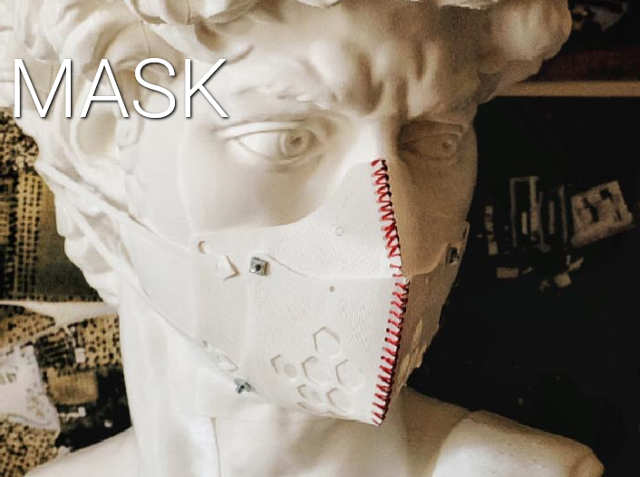

---

#### Masque de protection FPP2 jetable imprimé 3D (Statut: Non validé) 

- **PRESENTATION** Impression d'un masque N95 (FPP2) utilisant du filament Copper3D qui semblerait indiqué pour le matériel médical.
- **SITE** <https://www.atome3d.com/blogs/news/hackthepandemic-creez-votre-masque-3d>
- **VALIDATION** Non validé
- **TEMPS PAR UNITE** 2h 30
- **CAHIER DES CHARGES**
  - Filament Copper
  - Filtre HEPA
- **MATERIEL**
  - Imprimante 3D
- **PRIX PAR UNITE** 5€

<!--  -->
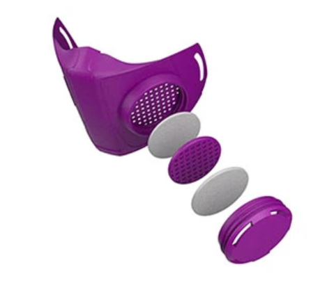

---

#### Projet de masque réutilisables à pression positive PAPR (Statut: En cours) 

- **PRESENTATION** Les "respirateurs à pression positive" (PAPR) mettent sous pression légère l'équipement de protection de façon à ce qu'en cas de fuite l'air contaminé ne puisse pas rentrer. C'est la protection utilisée dans les laboratoires de virologie BSL-3 et un des meilleurs équipement possible pour les soignants. [PAPR](https://en.wikipedia.org/wiki/Powered_air-purifying_respirator) (Besoin de traduction wikipedia FR). Le projet utilise un masque de plongée intégral (largement disponible et très bien conçu: Décathlon Easybreath, visiblement plusieurs milliers en stock) qui est confortable et par définition étanche. Il est modifié pour recevoir un équipement de filtration FPP3 à la place du tuba. La désinféction est possible d'après cette [publication](https://www.nature.com/articles/srep39956).
- **SITE** [Article et vidéo en italien](http://italianismo.com.br/2020/03/23/na-italia-engenheiro-cria-respirador-a-partir-de-mascara-de-mergulho/)
- **VALIDATION** En cours
- **TEMPS PAR UNITE**
  - Version simple: environ 2h
  - Version pression positive: environ 6h
- **CAHIER DES CHARGES**
  - MASQUE:
    - Masque EasyBreath Decathlon ou copie chinoise 20€
    - Connecteur tuba / ventilation imprimé en 3D
  - CARTOUCHE:
    - Cartouche imprimées 3D jetable 2€
    - Joint d'étanchéité pour la cartouche 0.5€
    - Filtre HEPA industriel d'aspirateur (filtration similaire FPP3) 2€
  - SYSTEME DE VENTILATION:
    - Ventilateur de PC 12v PWM
    - Batterie 12V de type perceuse
    - Coque imprimée en 3D
    - Système mécanique ou éléctronique de régulation du débit d'air
    - Tuyau de raccord ventilation & masque
- **PRIX PAR UNITE** 50-60€
- **BESOINS**
  - besoin de retours de médecins
  - besoin de spécialiste fabriquant / connaissant ces équipements
  - besoin de retour sur la stérilisation (eau bouillante, alcool, UV, impact sur les plastiques et silicones à voir ?)
  - besoin d'ingénieurs et de spécialiste de mécanique des fluides

  
    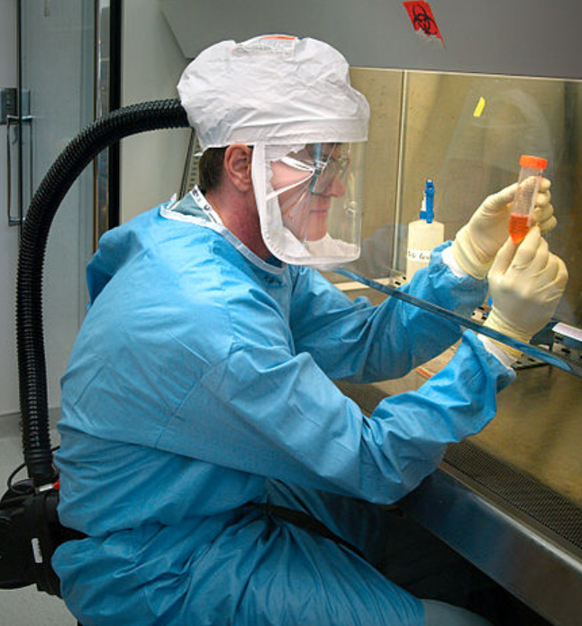
  
  
    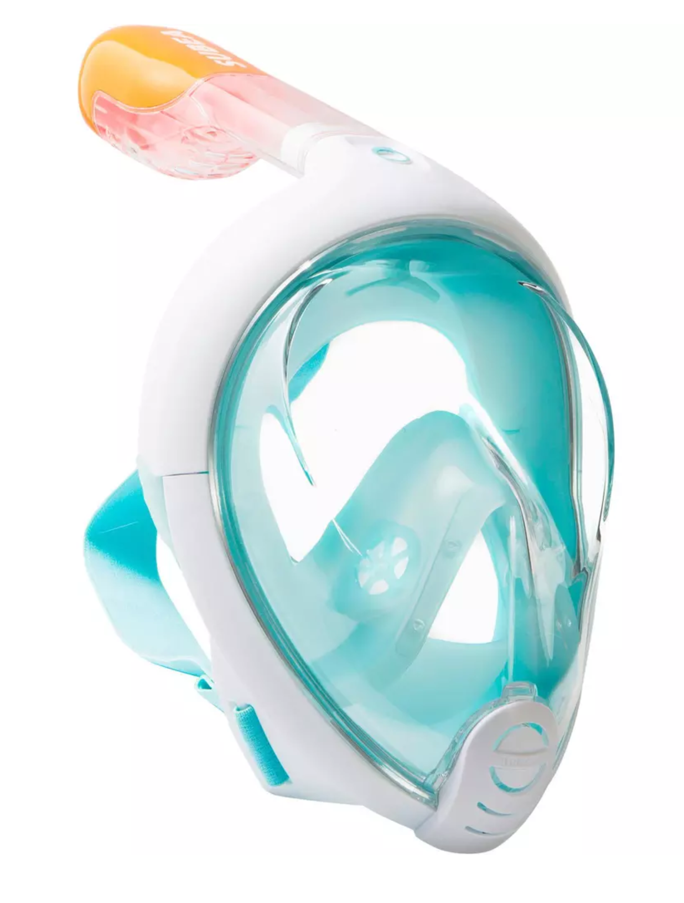
  

---

### RESPIRATEURS D'URGENCE 

Plusieurs idées et projets sont en cours de dévelopement dans différents pays et sont gérés par une communauté active de plusieurs centaines de personnes (en anglais) [Helpful Engineers](https://github.com/Helpful-Engineers/resources)
Les projets les plus avancés sont autour de l'utilisation des [Ballon autoremplisseur à valve unidirectionnelle](https://fr.wikipedia.org/wiki/Ballon_autoremplisseur_%C3%A0_valve_unidirectionnelle) largement disponibles dans les hôpitaux et homologués (aussi appellés Ambubag et BVM, BAVU).

---

#### Publications scientifiques

- [Publication MIT](https://web.mit.edu/2.75/projects/DMD_2010_Al_Husseini.pdf)
- [Publication Rice University](http://oedk.rice.edu/Sys/PublicProfile/47585242/1063096)

---

#### Respirateur basique "Ambubag" (Statut: en cours) 

- **PRESENTATION** Un mécanisme simple transforme un ambubag de ventilation manuel en un ambubag automatisé.
- **VALIDATION** En cours, plusieurs médecins ont validé.
- **SITE** <https://docs.google.com/document/d/1ly9UT5F0uIXBLi50U1m13eHRYHaN_rhwDnVimA0W1iI/edit>
  
<!-- 
 -->

  
    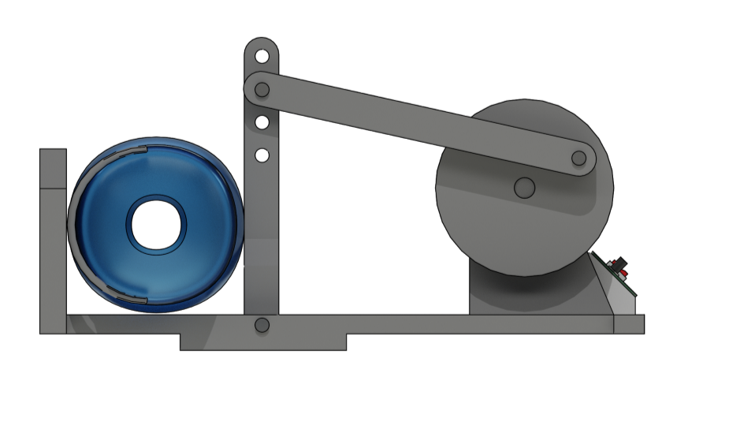
  
  
    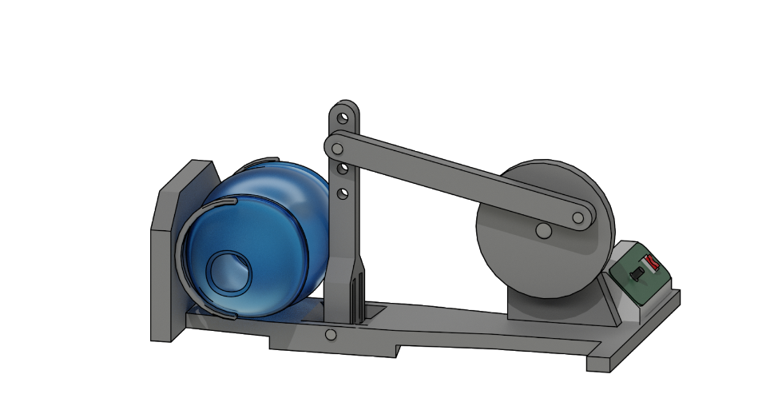
  

---

#### Respirateur OpenLung (Statut: avancé)

- **PRESENTATION** Un projet avancé qui transforme un ambubag de ventilation manuel en respirateur automatisé. (Besoin de traduction FR)
- **VALIDATION** En cours, médecins liés au projet.
- **SITE**
  - <https://gitlab.com/TrevorSmale/OSV-OpenLung>
  - <https://opensourceventilator.ie/>

<!--  -->

---

### Projet d'adaptation de respirateur CPAP (Statut: Avancé) 

- **PRESENTATION** Convertir un respirateur pour les apnées du sommeil en changeant son logiciel afin de le convertir pour le COVID-19. Le matériel étant déja homologué, seulement les modifications logiciels et un test pratique seront nécessaires).
- **SITE** [Fichiers et Code](https://github.com/jcl5m1/ventilator)

<!--  -->
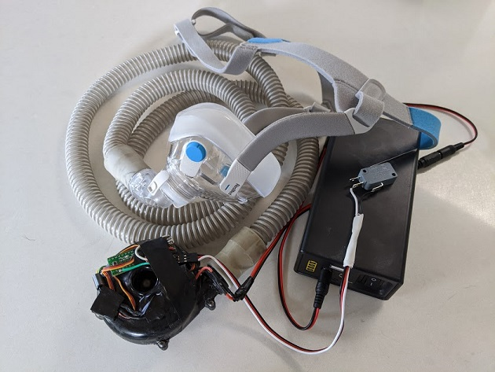

---

### Projet de respirateur Ventilaid (Statut: Non validé)

- **PRESENTATION** Un projet de ventilateur avancé sans validation médicale basé sur l'utilisation d'un piston de compression.
- **SITE** [Fichiers et Code](https://gitlab.com/Urbicum/ventilaid)
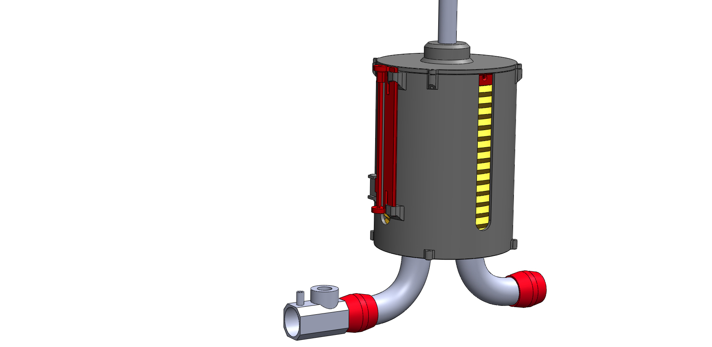

---

#### Valve de dédoublement des respirateurs médicaux (Statut: OK avec réserves) 

- **PRESENTATION** il est possible d'alimenter jusqu'à 9 patients avec le même respirateur suivant le modèle de respirateur. Les patients doivent avoir environ le même volume pulmonaire et le même stade de la maladie. Cela augmenterait significativement la capacité de réanimation ventilatoire existante. [Article Hackaday](https://hackaday.com/2020/03/19/saving-4-patients-with-just-1-ventilator/), [Vidéo](https://www.youtube.com/watch?v=uClq978oohY&feature=emb_title)
- **VALIDATION** Oui avec réserves (Publication: <https://onlinelibrary.wiley.com/doi/epdf/10.1197/j.aem.2006.05.009>)
[Publication sur l'impression 3D de ces valves](https://www.scirp.org/journal/paperinformation.aspx?paperid=49209)
- **SITE** [Fichiers 3D](https://github.com/Judoguy12/4-way-ventilator)
- **TEMPS PAR UNITE** environ 10h
- **PRIX PAR UNITE** 5€
- **CAHIER DES CHARGES**
  - PLA ou impression dans un matériel pro avec Sculpteo
- **BESOINS**
  - Besoin de connaitre les modèles des hôpitaux français, les tailles d'entrée, sortie pour le design paramétrique.
  - A quel point cela gène-t'il les patients?

<!--  -->
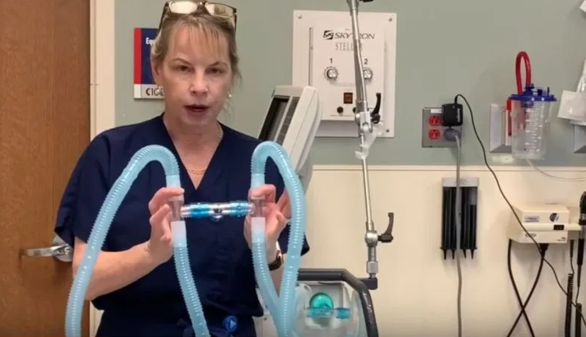

---

### AUTRES

#### Respirateurs vétérinaires  (Statut: En cours)

- L'utilisation de certains ventilateurs vétérinaires possèdant des caractéristiques similaires à celles des respirateurs "humains".

- L’impression 3D pourrait également permettre d’imprimer localement les différents éléments : valves, etc. dont les hôpitaux pourraient avoir besoin comme le cas italien des valves à 10.000€ imprimées à 1€. [Article sur la fabrication des valves en Italie](https://www.3dprintingmedia.network/covid-19-3d-printed-valve-for-reanimation-device/amp/)

### FAQ

`Comment comptez-vous réunir les imprimantes nécessaires, et où?`

Il existe de large parcs d’imprimantes 3D en France, FabLab et universités ainsi que des services en ligne comme [Sculpteo](https://www.sculpteo.com/fr/) qui pourraient être utilisés. Des distributeurs et fabricants d’imprimantes comme [Atome 3D](https://www.atome3d.com/) possèdent de nombreuses imprimantes en stock. Il existe également plusieurs entreprises ayant des parcs d’imprimantes disponibles. Il doit y avoir plusieurs milliers de machines de particuliers en France et il faudrait les recenser.
On pourrait imaginer une fois les modèles 3D validés par les experts que la production commence à l’instant même. Une fois configurée une imprimante 3D  n’est pas très différente d’une photocopieuse.
On pourrait également imaginer que de petits parcs de quelques imprimantes soient installés à coté / dans les hôpitaux pour pallier en flux tendus aux demandes de pièces plastiques : (valves, cartouches jetables, etc.) Il existe des risques de pénuries de pièces détachées suite au fort ralentissement de la production chinoise.

`Comment définir les priorités de distribution des produits finis?`
Une idée serait d’avoir dans/à coté de l’hôpital un petit parc d’imprimante qui produise en flux tendu à la demande les pièces en PLA nécessaires en quelques minutes / heures. Ceci est très différent des circuits longs de l’industrie classique.
Sculpteo ou d’autres services pourrait fournir les pièces plus complexes en Nylon, etc. et les livrer.

`Comment bypasser le protocole d'homologation des produits médicaux?`
Les matériels médicaux homologués seront évidemment prioritaires par rapport aux matériels imprimés et par rapport à l'extension des fonctionnalités d'autres machines médicales. Il s’agit plutôt de pallier une situation de pénurie critique et vitale avec des solutions rapides.
Le design collaboratif médical existe déjà avec des projets de matériel libre (à lire [Matériel libre](https://fr.wikipedia.org/wiki/Mat%C3%A9riel_libre)). Un exemple de projet open-hardware médical est le projet d’écho-stéthoscope à 50€: [Echopen](http://www.echopen.org/)

`Avez-vous en tête un objectif de date pour lancer une production?`
La production pourrait commencer très rapidement une fois les modèles 3D basiques conçus avec la possibilité d’une amélioration de la qualité des pièces avec le retour des utilisateurs suivant le modèle open-source et le recensement des participants et bénévoles.

Les étapes de ce circuit court en heures / jours pourraient être:

- Dessin paramétrique 3D d’un modèle basique fonctionnel
- Validation par un panel d’experts et ingénieurs confinés ou à la retraite
- Publication du modèle 3D libre de droit sur des plateforme de distribution comme GitHub ou Thingiverse.
- Mobilisation des participants et bénévoles par email
- Téléchargement gratuit du modèle 3D par les participants
- Impression des pièces
- Acheminement soit via un centralisateur bénévole soit par un professionel bénévole (type pharmacie, supermarché)
- Retour des soignants sur les défauts / amélioration des pièces produites.
- Nouveau cycle de dessin, d’amélioration, impression et distribution pour la v2, v3, etc. tous les quelques jours.

`Qui êtes-vous?`

- J’ai cofondé une NGO médicale il y plus de 10 ans [Action Aide Asie (Loi 1901)](http://actionaideasie.com/) avec lequel j’ai fait plusieurs dizaines de missions en Asie du Sud-Est, je m’occupe également d’une association de précarité lourde en milieu hospitalier en France. [Les Amis des Malades de l'Hôpital Cochin (RUP)](http://amisdesmalades.com/)
- Mon oncle Christophe est responsable d'un hôpital COVID-19 dans le Nord et son fils Romain est en première ligne comme médecin militaire urgentiste dans l’Est. Je suis en contact avec eux.
- L'expérience que j'ai acquise du système de santé des pays en voie de développement lors de mes missions montre le courage et la capacité d'adaptation des médecins face à la pénurie d'équipement, ces mêmes qualités dont nous avons besoin maintenant en France.
